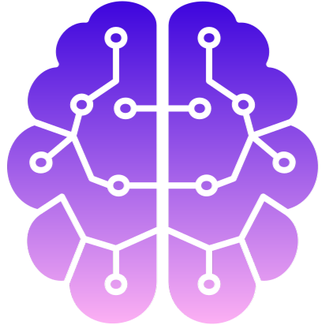

#  Blevins AI Tutor
#### A personal AI Tutor with access to course materials, lectures, and textbooks.

#### [https://blevins-ai-tutor.streamlit.app/](https://blevins-ai-tutor.streamlit.app/)

## Project Structure

```
ai-tutor/
├── .streamlit/                   # Streamlit app config
│   └── config.toml
├── app_utils/                    # Scripts for the tutor
│   ├── complete_assistant.py
│   ├── complete_tools.py
│   └── save_to_html.py
├── images/                       # Images
├── Lectures/                     # Lecture files
├── textbooks/                    # Textbooks
│   └── Morin/                    # Morin textbook files
├── main.py                       # Streamlit app
└── README.md
```
